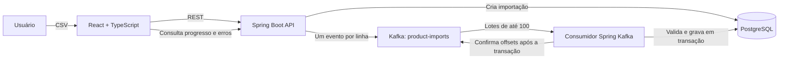

# Kafka Batch Processing

Exemplo full stack de importação de produtos por CSV, com processamento assíncrono em lotes usando Apache Kafka e persistência em PostgreSQL. A API e as mensagens do produto estão em português; o código-fonte segue convenções em inglês.

**Stack:** Java 21 · Spring Boot 3.4.1 · Spring Kafka · Apache Kafka 3.9.0 · PostgreSQL 16 · Flyway · React 19 · TypeScript · Vite

## Funcionalidades

- Envio de um ou vários arquivos CSV pela interface React ou pela API REST.
- Validação do cabeçalho antes de criar a importação e validação independente de cada linha.
- Publicação de um evento Kafka por linha e leitura pelo consumidor em lotes de até 100 mensagens.
- Persistência de produtos, resumo da importação e resultado por linha no PostgreSQL.
- Histórico paginado, atualização automática do progresso e consulta paginada de linhas rejeitadas ou duplicadas.
- Modelo CSV baixável na interface, pronto para editar e enviar.
- Reentrega segura: a chave única por importação e número da linha evita repetir resultados e contadores.

## Fluxo da aplicação



Ao receber um arquivo válido, a API cria a importação, publica os eventos e responde `202 Accepted`. O consumo continua em segundo plano. Cada lote grava produtos, resultados de linha e contadores em uma transação; os offsets Kafka são confirmados depois que a gravação termina.

## Tecnologias e estrutura

```text
.
├── compose.yaml                         # Kafka e PostgreSQL para desenvolvimento local
├── exemplo-produtos.csv                 # CSV de exemplo para a API
├── pom.xml                              # Backend Java e dependências de teste
├── src/main/java/com/example/kafkabatch # API, produtor, consumidor e processamento
├── src/main/resources/db/migration      # Migrações Flyway
├── src/test/java                        # Testes de integração
└── frontend                             # Interface React + TypeScript + Vite
```

O tópico `product-imports` é criado pela aplicação com três partições. O consumidor roda com concorrência três e `max.poll.records=100`. O banco usa restrição única no SKU do produto e na combinação `(import_id, row_number)` dos resultados de linha.

## Requisitos

- Java 21+
- Maven 3.9+
- Node.js 22+ e npm
- Docker com Docker Compose
- Portas locais disponíveis: `8080` (API), `5173` (frontend), `9092` (Kafka) e `5432` (PostgreSQL)

## Como executar

Clone o repositório:

```bash
git clone https://github.com/casmtts/kafka-batch-processing.git
cd kafka-batch-processing
```

Na raiz do projeto, inicie Kafka e PostgreSQL:

```bash
docker compose up -d
```

Os serviços do Compose usam as credenciais locais de desenvolvimento `kafka/kafka`. Não reutilize esses valores em ambientes compartilhados ou de produção.

Inicie a API em outro terminal:

```bash
mvn spring-boot:run
```

O Flyway cria as tabelas automaticamente. O backend estará disponível em `http://localhost:8080`.

Em outro terminal, suba o frontend:

```bash
cd frontend
npm ci
npm run dev
```

Abra [http://localhost:5173](http://localhost:5173). O Vite encaminha chamadas `/api` ao backend em `http://localhost:8080`. Na interface, baixe o CSV de exemplo, altere os produtos se desejar, mantenha o cabeçalho e selecione um ou mais arquivos para enviar. O painel atualiza o histórico e os detalhes periodicamente.

## Formato do CSV

O arquivo precisa ser CSV UTF-8, separado por vírgulas, com o cabeçalho exato abaixo:

```csv
sku,nome,preco,estoque
P-001,Caderno,12.50,20
P-002,"Caneta, azul",3.90,50
P-001,Caderno repetido,14.00,10
P-003,Produto inválido,abc,4
```

- `sku`: obrigatório, até 100 caracteres.
- `nome`: obrigatório, até 255 caracteres.
- `preco`: decimal não negativo, com ponto e até duas casas.
- `estoque`: inteiro não negativo.
- Campos contendo vírgula devem ficar entre aspas.
- O limite de upload é 20 MB por arquivo.

O exemplo acima resulta em dois produtos importados, uma linha duplicada e uma rejeitada por preço inválido. O SKU repetido no mesmo arquivo ou já existente no banco é contabilizado como duplicado e não atualiza o produto. Uma linha inválida não interrompe as demais. Arquivo vazio ou cabeçalho incompatível retorna `400` sem criar uma importação.

## API REST

Todas as rotas usam o prefixo `/api/imports`.

| Método e rota | Descrição |
| --- | --- |
| `POST /api/imports` | Envia um CSV multipart no campo `file`; responde `202` com o ID, status e nome do arquivo. |
| `GET /api/imports?page=0&size=20` | Lista importações recentes com paginação. |
| `GET /api/imports/{id}` | Consulta status, progresso, contadores e motivo de falha. |
| `GET /api/imports/{id}/errors?page=0&size=20` | Lista linhas rejeitadas ou duplicadas. |

O parâmetro `page` começa em zero; `size` aceita valores de 1 a 100. As rotas de consulta retornam `404` quando o ID não existe.

### Enviar arquivo

```bash
curl -i -F "file=@exemplo-produtos.csv;type=text/csv" \
  http://localhost:8080/api/imports
```

Resposta `202 Accepted`:

```json
{
  "id": "d55a55f0-6bf1-4ec5-a49d-649015344c55",
  "status": "PROCESSANDO",
  "arquivo": "exemplo-produtos.csv"
}
```

### Consultar status e erros

```bash
curl http://localhost:8080/api/imports/d55a55f0-6bf1-4ec5-a49d-649015344c55
curl 'http://localhost:8080/api/imports/d55a55f0-6bf1-4ec5-a49d-649015344c55/errors?page=0&size=20'
curl 'http://localhost:8080/api/imports?page=0&size=20'
```

Status possíveis:

| Status | Significado |
| --- | --- |
| `PROCESSANDO` | Publicação ou consumo das linhas ainda está em andamento. |
| `CONCLUIDA` | Todas as linhas foram processadas sem rejeições nem duplicatas. |
| `CONCLUIDA_COM_ERROS` | Processamento terminou e há linhas rejeitadas ou SKUs duplicados. |
| `FALHA` | Houve falha ao ler ou publicar o arquivo; linhas já publicadas ainda podem ser processadas. |

O resumo inclui `totalLinhas`, `linhasProcessadas`, `importadas`, `rejeitadas`, `duplicadas`, `criadoEm`, `finalizadoEm` e, em caso de falha, `motivoFalha`. A resposta de erros lista `linha`, `sku`, `resultado` (`REJEITADA` ou `DUPLICADA`) e `motivo`.

## Configuração

Os valores abaixo podem ser substituídos por variáveis de ambiente:

| Variável | Padrão | Uso |
| --- | --- | --- |
| `DB_URL` | `jdbc:postgresql://localhost:5432/kafka_batches` | URL JDBC do PostgreSQL. |
| `DB_USER` | `kafka` | Usuário do banco. |
| `DB_PASSWORD` | `kafka` | Senha do banco. |
| `KAFKA_BOOTSTRAP_SERVERS` | `localhost:9092` | Endereço dos brokers Kafka. |

O tópico é configurado por `app.kafka.topic` em `src/main/resources/application.yml` e, por padrão, chama-se `product-imports`.

## Idempotência e processamento

O processamento oferece entrega pelo menos uma vez. Cada resultado de linha é identificado por `(import_id, row_number)`. Se Kafka reenviar um evento que já foi concluído, ele não insere outro produto nem incrementa os contadores novamente. As gravações do lote são transacionais; o consumidor confirma offsets manualmente depois do processamento. SKU é a chave primária de `products`, garantindo que um item existente não seja sobrescrito.

## Testes e build

Os testes de integração usam Kafka embarcado e Testcontainers para PostgreSQL; Docker precisa estar ativo para executá-los:

```bash
mvn test
```

Para compilar a interface sem iniciar o servidor de desenvolvimento:

```bash
cd frontend
npm ci
npm run build
```

## Encerrar os serviços

```bash
docker compose down
```

Para apagar também os dados persistidos no volume local do PostgreSQL:

```bash
docker compose down -v
```
